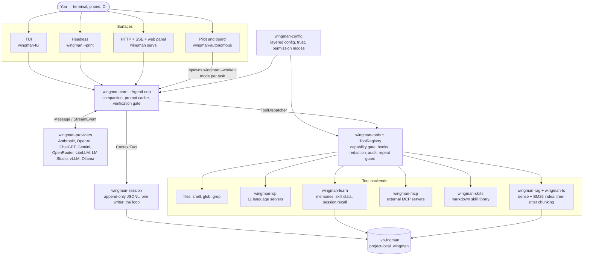
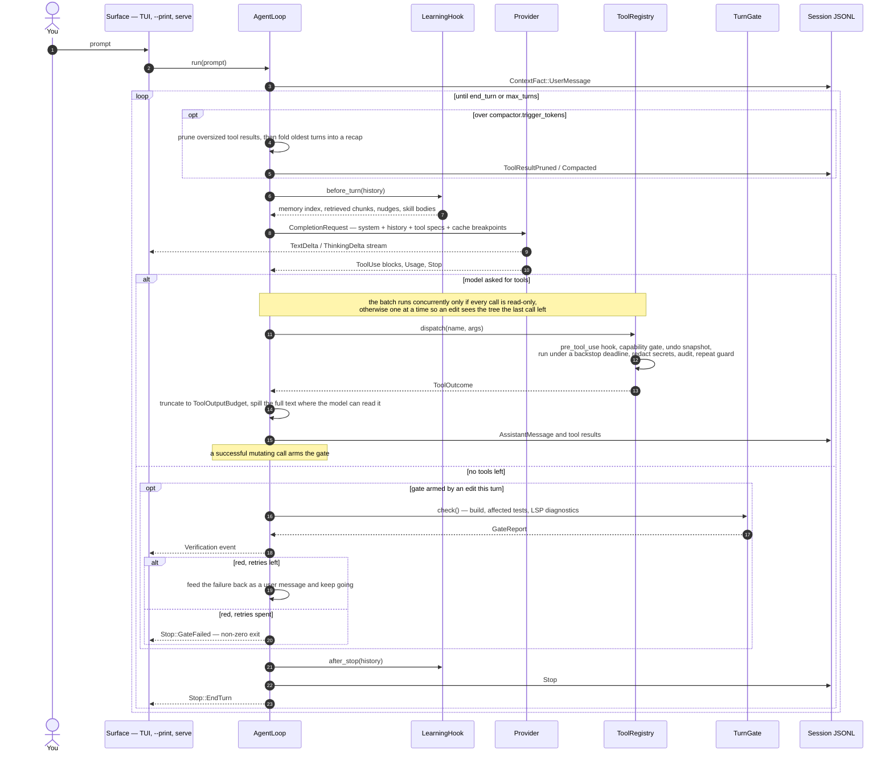
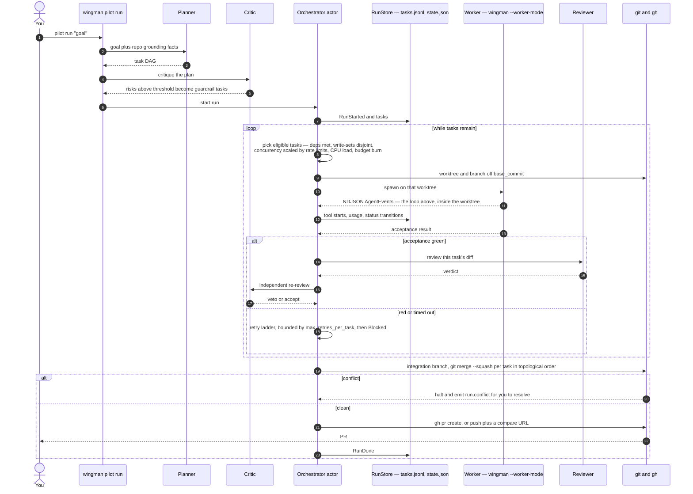
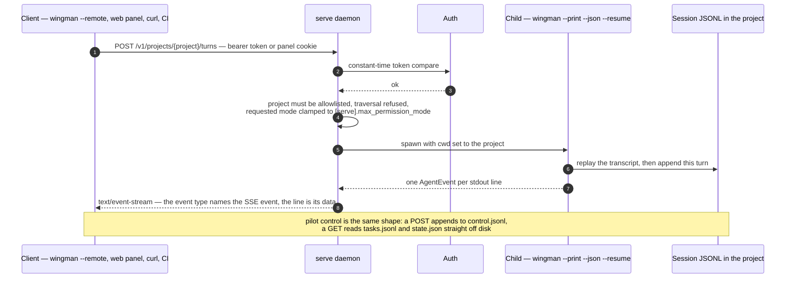
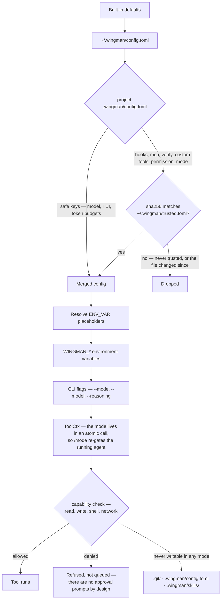

<p align="center">
  
</p>

# Wingman

[](https://github.com/vedantnimbarte/Wingman/actions/workflows/ci.yml)

**A terminal coding agent that asks the compiler instead of guessing.**

Most agents answer "where is this used, and what breaks if I change it" by
grepping and reading files until the context window fills. Wingman asks the
language server and a local semantic index, so it resolves imports, types, and
re-exports rather than matching names — and it spends a fraction of the context
doing it.

```
$ wingman context
  system prompt       583 tokens
  tool schemas       3653 tokens  (24 tools)
  --------------------------------------------
  first turn         4236 tokens  before your prompt
```

Run that in your own repo. Every agent pays a per-turn context tax and almost
none of them will tell you what it is.

---

## What makes it different

Five things Wingman does that comparable agents don't. Everything else it does
is table stakes, and lives in [docs/FEATURES.md](docs/FEATURES.md).

**1. Resolved code intelligence, not grep.**
`lsp_definition`, `lsp_references`, `lsp_hover`, `lsp_rename`, and
`lsp_code_action` run through whatever language server is on your `PATH`
(rust-analyzer, pyright, typescript-language-server, gopls — 11 languages).
A rename is the language server's rename, not a find-and-replace that catches
a comment. With no server installed the tools degrade to tree-sitter
heuristics rather than failing. See [docs/LSP.md](docs/LSP.md).

**2. It has to prove the work before it says "done".**
The verification gate runs your build, the affected tests, and the language
server's diagnostics for the changed files before the agent may end a turn:
`✓ builds  ✓ affected tests  ✓ 0 new LSP diagnostics`. On red it retries a
bounded number of times (`[verify].max_retries`, default 2), then stops and
exits non-zero. Bounded correction, not loop-until-green.

**3. No provider lock-in — and it will price the alternative for you.**
One `Message` contract over Anthropic, OpenAI, ChatGPT (OAuth), Gemini,
OpenRouter, LiteLLM, LM Studio, vLLM, and Ollama. That contract covers
reasoning too: one `--reasoning off|low|medium|high` maps onto Anthropic's
thinking budget, OpenAI's `reasoning_effort`, and Gemini's `thinkingConfig`,
so switching provider doesn't mean relearning a parameter — and `wingman
doctor` tells you when a backend has no reasoning control rather than letting
the setting look like it took. `wingman cost --compare`
reprices your actual token volume against a spread of models, showing what the
same work would have cost elsewhere. Only a provider-agnostic agent can show
you that number. See [docs/PROVIDERS.md](docs/PROVIDERS.md).

**4. It remembers your repo between sessions.**
Memories are plain markdown files under `~/.wingman/memory/` and
`<project>/.wingman/memory/` — readable, editable, deletable, and shareable
over git (`wingman memory sync`). Plus a hybrid dense + BM25 index of the
codebase and semantic recall across past sessions. Not an opaque store you
have to trust. See [docs/LEARNING-LOOP.md](docs/LEARNING-LOOP.md).

**5. Windows is a first-class target.**
Developed and tested on Windows from day one, not ported to it. The one place
this is currently *not* true is shell containment — see
[Known limits](#known-limits), which says so rather than hiding it.

### What it deliberately doesn't do

It doesn't push your code to anyone's cloud — BYO key, everything local. It
doesn't reuse a subscription token to dodge API billing. It doesn't headline
agent count: the two firms who have published the most on parallel agents both
concluded that writes should stay single-threaded, and pilot mode serialises
tasks whose write-sets overlap rather than racing them. And it doesn't claim
your shell is sandboxed when it isn't — `wingman doctor` reports exactly which
containment is active on your machine.

---

## Installation

**macOS / Linux:**

```bash
curl -fsSL https://raw.githubusercontent.com/vedantnimbarte/Wingman/main/scripts/install.sh | sh
```

**Windows (PowerShell):**

```powershell
irm https://raw.githubusercontent.com/vedantnimbarte/Wingman/main/scripts/install.ps1 | iex
```

Downloads the `wingman` binary for your platform from the latest
[release](https://github.com/vedantnimbarte/Wingman/releases) and puts it on
your `PATH` (default `~/.local/bin`; override with `WINGMAN_INSTALL_DIR`, pin a
tag with `VERSION=v0.1.0`).

Prebuilt targets: Linux x86_64/aarch64 (glibc ≥ 2.38 — Ubuntu 24.04+, Debian
13+, Fedora 39+), macOS Apple silicon, Windows x86_64. On anything else, build
it:

```bash
cargo install --git https://github.com/vedantnimbarte/Wingman wingman-cli
```

Building needs Rust 1.80+ and a C toolchain for some transitive crates.

---

## Quick start

```bash
wingman config init             # scaffold ~/.wingman/config.toml
export ANTHROPIC_API_KEY=sk-ant-...
wingman                         # interactive TUI in the current project
```

Local providers (Ollama, LM Studio, vLLM) need no key — point `base_url` at
the running instance.

```bash
# Headless one-shot
wingman --print "explain the agent loop in crates/wingman-core"

# Headless, newline-delimited JSON events
wingman --print "list the public types in wingman-core" --json

# Pick a model for this session only
wingman --model openai/gpt-4.1

# Loosen the permission model for this session
wingman --mode auto-edit

# Think harder before answering (off by default — thinking tokens cost)
wingman --reasoning high
```

Useful TUI commands: `/model` swaps the active model live, `/mode` changes the
permission mode, `/reasoning` sets how hard the model thinks, `/mcp` manages
MCP servers, `/memory` lists saved facts, `/recall <query>` searches past
sessions, `/find <query>` searches the transcript. Full list in
[docs/CLI.md](docs/CLI.md).

Tell it things like "remember that I prefer pnpm over npm" and it will call
`save_memory`; the next session sees it in the system prompt.

---

## Permission model

`read-only` is the default. Each tool declares what it needs (read / write /
shell / network) and the registry refuses anything the active mode doesn't
grant — enforced centrally, not per-tool.

| Mode | What the agent may do |
| --- | --- |
| `read-only` | Read and search. No writes, no shell. Default. |
| `plan` | Read-only until you `/approve` its plan, then auto-edit. |
| `auto-edit` | Write inside the project tree; shell auto-allowed, subject to the denylist. |
| `yolo` | No guardrails. Per-session only, never persisted. |

`.git/`, `.wingman/config.toml`, and `.wingman/skills/` are never writable, in
any mode. A cloned repo's `.wingman/config.toml` may pick a model and tune the
UI but not run commands — `[hooks]`, `[mcp]`, `[verify]`, `[providers]`, and
`permission_mode` are ignored until you run `wingman trust` in that repo, and
trust lapses whenever the file changes.

There are no interactive approval prompts by design: a disallowed call is
refused, not queued.

---

## Configuration

Layered: defaults → `~/.wingman/config.toml` → `<project>/.wingman/config.toml`
→ `WINGMAN_*` env vars → CLI flags. TOML sub-tables merge instead of
clobbering.

```toml
default_provider = "anthropic"
permission_mode  = "read-only"

[providers.anthropic]
api_key = "${ANTHROPIC_API_KEY}"
model   = "claude-opus-4-7"

[verify]
enabled = true              # build + affected tests before a turn may finish

[tools]
shell_sandbox = "auto"      # bwrap / sandbox-exec where available
```

Every knob, plus environment variables and on-disk layout, is in
[docs/CONFIGURATION.md](docs/CONFIGURATION.md).

---

## Pilot mode

`wingman pilot run "<goal>"` plans a multi-task piece of work, spawns worker
agents in isolated git worktrees, and converges their output into one PR.

```bash
wingman pilot run "add a --version-only flag to wingman-cli"
wingman pilot run --plan-only "<goal>"   # write tasks.jsonl and exit
wingman pilot watch                      # live dashboard
```

Three capability tiers — `assist` (you approve everything), `copilot` (the
default; the agent flies, you intervene at decision points), and `autopilot`
(experimental, adds the discovery daemon and critic agent). `copilot` runs
end-to-end against a live provider and is user-validated, not CI-validated:
use a spend cap and read the PR. Details in
[docs/PILOT-MODE.md](docs/PILOT-MODE.md).

---

## The board

`wingman board` is a kanban board over pilot runs — persistent, and across
every repo you've run pilot in. Cards are goals you author; they outlive the
runs that execute them, so a backlog survives what pilot forgets.

```bash
wingman board                            # the TUI
wingman board add "fix the LSP restart storm"
wingman board dispatch a3f1              # starts a pilot run for that card
wingman board list --json                # scriptable
```

Columns — Backlog, Planned, In Progress, Review, Done — are **derived** from
run state, never stored, so the board can't disagree with `pilot watch`.
Expand a card to see the planner's tasks underneath it: which agent took each
one, which model it ran on, what it cost, what it's blocked on, and the
session id of its transcript. Details in [docs/BOARD.md](docs/BOARD.md).

---

## Remote control

`wingman serve` puts an HTTP/SSE API in front of an allowlist of repos, so you
can drive Wingman from another machine, a phone, a Shortcut, or CI without a
terminal on the box doing the work.

```bash
wingman serve --init-token       # mint a token into the OS keyring, printed once
wingman serve                    # bind [serve].addr, serve the allowlisted repos

wingman --remote http://box:8787 --print "why is the index stale?"
wingman --remote http://box:8787 pilot watch
```

Pilot runs are steerable (approve, veto, abort, retry), turns stream back over
SSE, and the rest of the CLI is reachable. A request can never obtain more
authority than `[serve].max_permission_mode`, and a stolen token reaches only
the repos you listed. **Wingman does not terminate TLS** — put it behind
Tailscale, a WireGuard subnet, an SSH tunnel, or a TLS proxy. Full surface in
[docs/HTTP-API.md](docs/HTTP-API.md).

---

## How it works

Four views of the same system: what the pieces are, what one turn does, what a
pilot run does, and how a remote turn reaches the agent. Deeper detail —
crate-by-crate responsibilities, session-log invariants, threading — is in
[docs/ARCHITECTURE.md](docs/ARCHITECTURE.md).

### Architecture

Every surface — TUI, `--print`, `wingman serve`, and each pilot worker — drives
the same `AgentLoop` in `wingman-core`. Providers, tools, and the permission
model hang off it as traits, which is why swapping a model or a language server
changes nothing about the loop.



### One turn

`AgentLoop::run` drives a single user turn to completion. Everything the model
will see is emitted as a `ContextFact` first, so the transcript on disk
reconstructs the request exactly — that invariant is why the loop is the only
writer of the session log.



### A pilot run

`wingman pilot run` plans a task DAG, runs each task as its own `wingman`
subprocess in its own git worktree, and squash-merges the survivors onto one
integration branch. The orchestrator is a single-writer actor, so run state and
the JSONL log can never disagree.



### A remote turn

`wingman serve` keeps no conversation state. A session *is* the JSONL file the
TUI writes, so a turn started on a phone resumes in the terminal — and each turn
runs as a child process, because project resolution is process-wide and a
panicking turn must not take the daemon with it.



### Config and permissions

Config resolves in layers, but the project layer is split: a cloned repo's
`.wingman/config.toml` may pick a model and tune the UI, while the keys that
execute things merge only after `wingman trust` — recorded as a hash of the file
bytes, so editing a trusted config revokes trust. Enforcement then happens once,
centrally, in the registry: a tool that forgets to check its own permissions
fails closed rather than open.



---

## Known limits

Pre-1.0. The parts worth knowing before you lean on them:

- **Shell containment is platform-dependent.** Filesystem scoping is real via
  `bwrap` on Linux and `sandbox-exec` on macOS. **Windows gets less:** a Job
  Object (no orphaned processes, no clipboard or cross-process handle access,
  capped process count) but *no filesystem scoping* — a shell command there can
  still read credentials outside the project, so `shell_sandbox = "required"`
  still refuses to run rather than pretend otherwise. `wingman doctor` reports
  exactly which you have.
- **Pilot mode is user-validated, not CI-validated** end-to-end. CI runs the
  unit suite.
- **Browser verification fails open, and is local-only.** Needs
  `--features browser` and Chrome; with no browser present the gate passes
  rather than blocking. That feature also links a GPL-3.0 dependency, so a
  binary built with it is not redistributable under Apache-2.0 — use it on your
  own machine, don't ship it. See
  [docs/DEPENDENCIES.md](docs/DEPENDENCIES.md).
- **Skill "outcome scoring" is a phrase heuristic** over your replies, not a
  learned signal. Treat the numbers as a rough tally.
- **The HTTP API has no TLS and one token.** It is a plaintext listener meant
  to sit behind a tunnel or a reverse proxy, with a single shared secret and no
  per-token scopes. At the default `auto-edit` ceiling, whoever holds that
  token can make the agent edit files in the repos you allowlisted.
- **Team memory and Slack intake need your infrastructure** — they speak simple
  HTTP contracts, you supply the endpoint.
- **The `vm` sandbox tier is fail-closed**: pilot refuses vm-tier tasks rather
  than running them unsandboxed.

Known gaps are tracked as
[issues](https://github.com/vedantnimbarte/Wingman/issues) rather than hidden.
[SECURITY.md](SECURITY.md) has the threat model and what is deliberately out of
scope.

---

## Documentation

| Doc | What's in it |
| --- | --- |
| [FEATURES.md](docs/FEATURES.md) | The complete feature list |
| [CLI.md](docs/CLI.md) | Every subcommand |
| [CONFIGURATION.md](docs/CONFIGURATION.md) | Every config knob, env vars, disk layout |
| [TOOLS.md](docs/TOOLS.md) | Built-in tool reference |
| [PROVIDERS.md](docs/PROVIDERS.md) | Supported backends and pilot-mode support |
| [PILOT-MODE.md](docs/PILOT-MODE.md) | Multi-agent orchestration |
| [BOARD.md](docs/BOARD.md) | The kanban board over pilot runs |
| [ARCHITECTURE.md](docs/ARCHITECTURE.md) | System design, crates, data flows |
| [LSP.md](docs/LSP.md) | Code intelligence and verification receipts |
| [LEARNING-LOOP.md](docs/LEARNING-LOOP.md) | Memories, skills, session recall |
| [EXTENDING.md](docs/EXTENDING.md) | Hooks, slash commands, custom tools |
| [HTTP-API.md](docs/HTTP-API.md) | The `wingman serve` API and `--remote` |
| [WEB-UI.md](docs/WEB-UI.md) | The browser control panel `wingman serve` hosts |
| [SDK.md](docs/SDK.md) | Embed `wingman-core`, or drive it over MCP or HTTP |
| [INDEX.md](docs/INDEX.md) | Navigation guide for all docs |

---

## Development

```bash
cargo build              # debug build
cargo test               # full test suite
cargo fmt                # rustfmt.toml is project-pinned
cargo clippy             # lints
cargo run -- --mode auto-edit          # TUI from source
cargo run -- --print "what does crates/wingman-core do?"
```

Logs go to `~/.wingman/logs/`. Override with `WINGMAN_LOG=debug` or the
`[logging]` config block.

---

## Contributing

Issues and pull requests are welcome. Before opening a PR: `cargo fmt` and
`cargo clippy` clean, `cargo test` passing, and new behaviour covered by a test
where reasonable.

## License

Licensed under the Apache License, Version 2.0.
